# FS-AI ADS-DV User Manual

## Document Control

| Version | Date       | Changes                                                      |
| ------- | ---------- | ------------------------------------------------------------ |
| 1.0     | 2026-04-04 | Initial version of document.                                 |

> The master copy of this document is stored at [FS-AI/FS-AI_ADS-DV_Documentation](https://github.com/FS-AI/FS-AI_ADS-DV_Documentation). 
> Always check you have the latest version, as printed copies, PDFs, downloads, or repository clones may be out of date.

## Table of Contents

1. [Introduction](#1-introduction)
2. [Key Equipment](#2-key-equipment)
3. [User Interface](#3-user-interface)
4. [Inspection](#4-inspection)
5. [Preparation for Operation](#5-preparation-for-operation)
6. [Autonomous Operation](#6-autonomous-operation)
7. [Preparation for Storage](#7-preparation-for-storage)
8. [Charging the Traction Battery](#8-charging-the-traction-battery)
9. [Checking and Resetting the Inertia Switch](#9-checking-and-resetting-the-inertia-switch)
10. [Charging the RES Battery](#10-charging-the-res-battery)
11. [Support Contacts](#11-support-contacts)

## 1. Introduction

This document provides details of the procedures that should be followed to operate the FS-AI ADS-DV safely.

Common terms and abbreviations used across the current ADS-DV documentation set are defined in the [FS-AI ADS-DV Glossary](./FS-AI%20ADS-DV%20Glossary.md).

## 2. Key Equipment

The key equipment for operating the ADS-DV consists of:

- ADS-DV
- Remote Emergency Stop (RES)

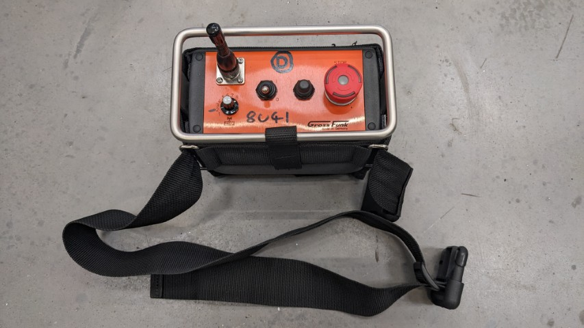

- Red Switch Keys (x3 + 1 spare)

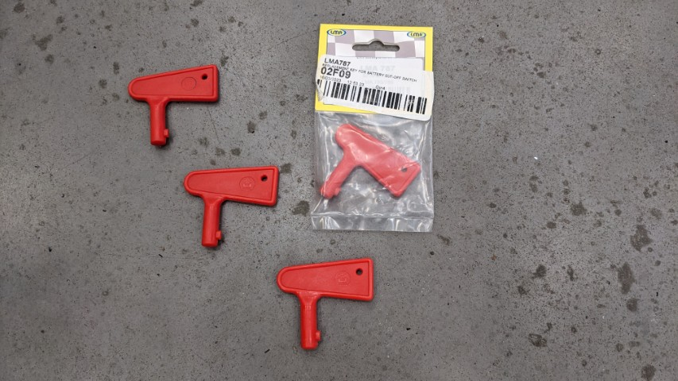

- MPP Dongle

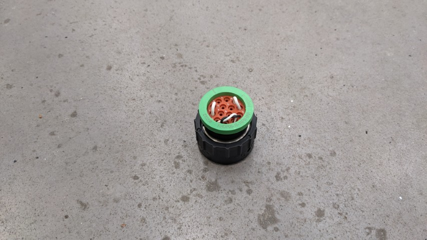

- GEMS DA3 Datalogger Memory Card

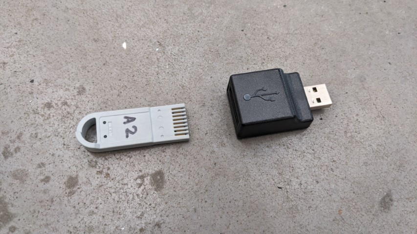

- Traction Battery Charger

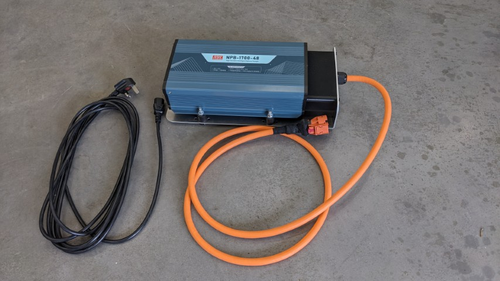

- RES Battery Charger

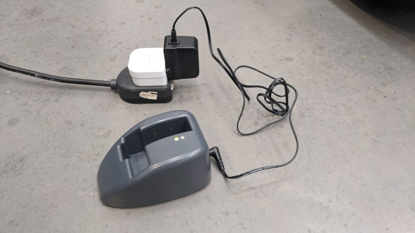

> **Note:** The ADS-DV may be provided with additional items not listed above. This is not a complete inventory. These may include:
>
> - Quick Lift Jack
>
>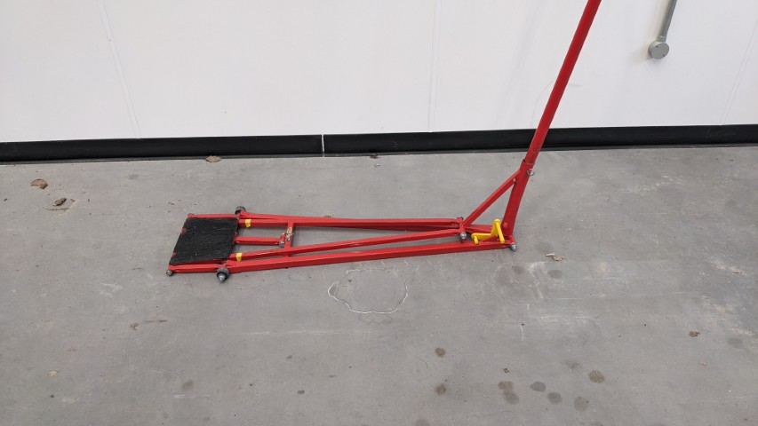
>
> - Skateboard Trolleys (x2)
>
>>[image to be added](images)
>
> - Plastic Ramps
>
>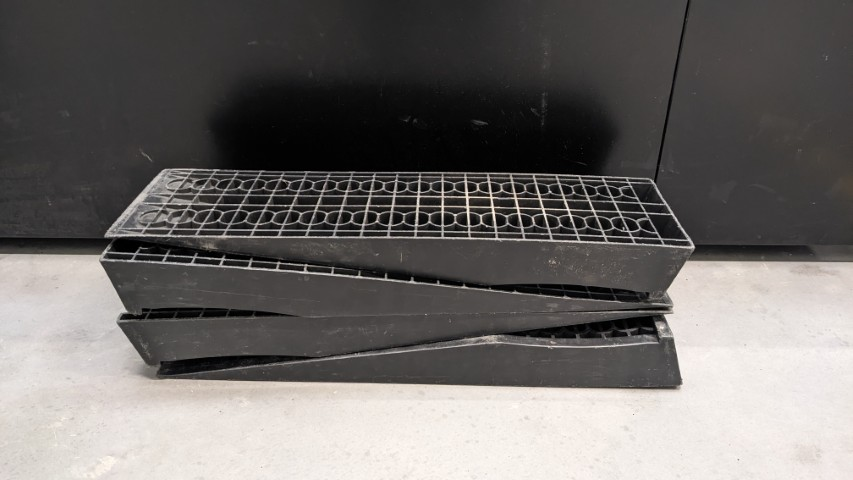
>
> - Spares

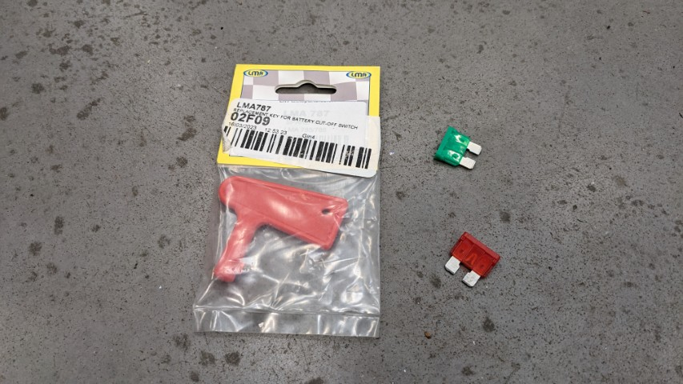

## 3. User Interface

The key elements of the ADS-DV user interface are:

- Red Switch Keys (x3)
- Remote Emergency Stop (RES)

- Side Emergency Stop Switches (x2)

  

- AI Power Switch

>[image to be added](images)

- Multi-Purpose Port (MPP) and MPP Dongle

>[image to be added](images)

- Charger Port

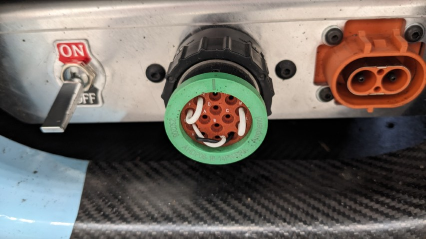

- Tractive System Active Light (TSAL) LED Indicators

 for full details.

## 5. Preparation for Operation

### 5.1. Equipment Required

- MPP Dongle
- Remote Emergency Stop (RES)
- Red Switch Key (x1)

### 5.2. Procedure

1. Verify the AI Power Switch is switched "Off".
2. Connect the MPP Dongle to the MPP.

3. Ensure the RES has a charged battery installed.
4. Enable the RES by twisting the RES Emergency Stop button clockwise until it pops up.
5. Verify the RES is active by observing the Status LED is lit Red.

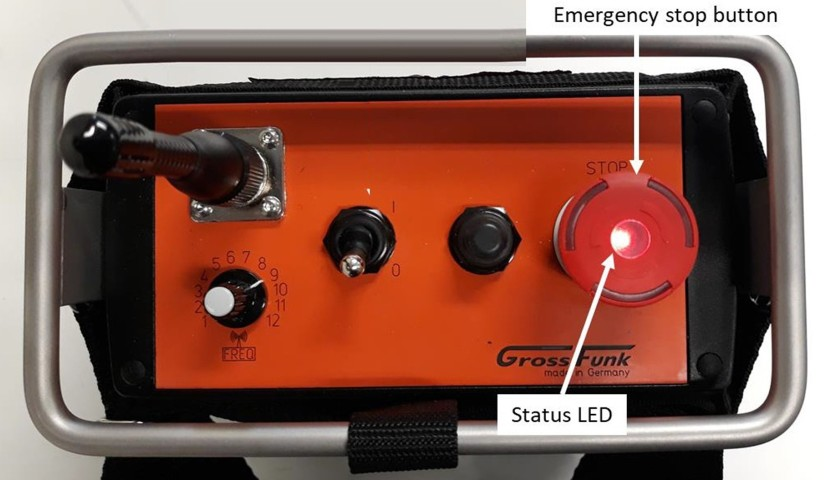

   > **Note:** The RES Red LED will flash if the battery is low on charge. It may also emit an audible tone. If this occurs, fit a charged battery and recharge the flat battery using the provided RES Battery Charger.

   > **Note:** For any Static Operation or Autonomous Operation, the Autonomous Systems Responsible person (ASR) must keep the RES strapped securely around their waist and on their person at all times while the ADS-DV is active. It must not be held in one hand, put down, or moved out of immediate reach.

6. Verify the Side Emergency Stop Switches are "Out". If not, twist them clockwise so they pop out.
7. Turn "On" the LV Master Switch.
8. Verify the TSAL indicator LEDs show "Green".
9. Verify the Touch Screen Interface starts up.
10. Verify the E-Stop Loop indicator on the Touch Screen shows "Green".

    > **Note:** To complete the E-Stop Loop all the following need to be correct:
    >
    > - RES active
    > - Side Emergency Stop Switches "Out"
    > - MPP Dongle present
    > - Inertia Switch "Closed" (see [Section 9](#9-checking-and-resetting-the-inertia-switch))

11. Verify the LV Battery voltage is above 13.5V, indicating the DCDC converter is working. Typically, this will read between 13.5V and 14.5V.

> **Note:** If the LV Battery voltage remains below 13.0V, turn off the LV Master Switch and contact FS-AI Technical Support.

12. Verify the Traction Battery voltage is above 47.5V. If it is lower than this, do not operate the vehicle. Instead, charge the Traction Battery according to the procedure below.

13. Verify the status of the ADS-DV systems on the Touch Screen as follows:

    - "AS Init"
    - "OP Init"
    - "TS Init"
    - "EBS Init"

Assuming the above is all correct, the ADS-DV is now ready for Autonomous Operation. The image below shows a valid ADS-DV Status:

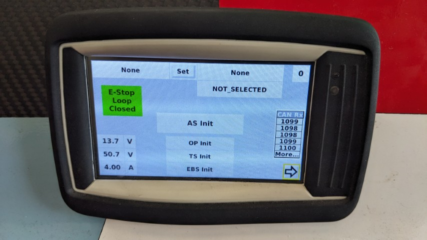

## 6. Autonomous Operation

Autonomous Operation of the ADS-DV requires the presence of valid CAN signals from the Compute Platform to the ADS-DV.

> **Note:** Currently the software interface is unchanged from previous years. Refer to [FS-AI ADS-DV Software Interface Specification](./FS-AI%20ADS-DV%20Software%20Interface%20Specification.md).

### 6.1. Equipment Required

- MPP Dongle
- Remote Emergency Stop (RES)
- Red Switch Keys (x3)
- GEMS DA3 Datalogger Memory Card
- Compute Platform

> **Note:** The Compute Platform refers to any hardware used to send CAN signals to the ADS-DV. This may be the provided InCarPC or any other hardware used to control the ADS-DV.

### 6.2. Procedure

1. Verify the ADS-DV is ready according to [Inspection](#4-inspection) and [Preparation for Operation](#5-preparation-for-operation) above.
2. Verify the Compute Platform is connected to one of the AI Power and CAN connectors of the ADS-DV.
3. Turn on the AI Power Switch, or confirm it is already on, to supply power to the Compute Platform.
4. Turn on the LV Master Switch, or confirm it is already on.

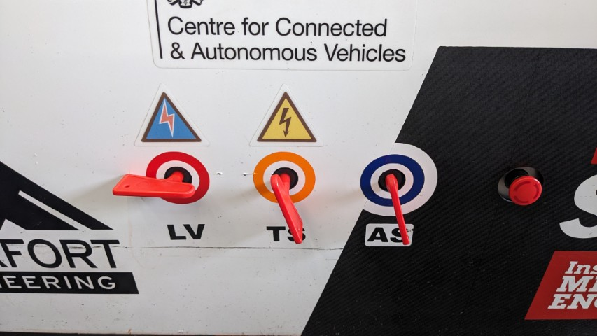

5. Turn "On" the Autonomous System Master Switch (ASMS) and turn "On" the Tractive System Master Switch (TSMS).

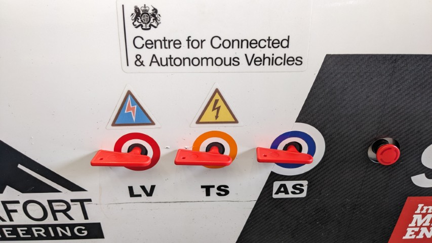

6. Ensure the Compute Platform is sending CAN signals to the ADS-DV.

   > **Note:** As soon as valid CAN signals are received by the ADS-DV, the Tractive System and Emergency Brake System will activate.

7. Wait for the TSAL Indicator LEDs to show "Red", indicating the Tractive System is active.

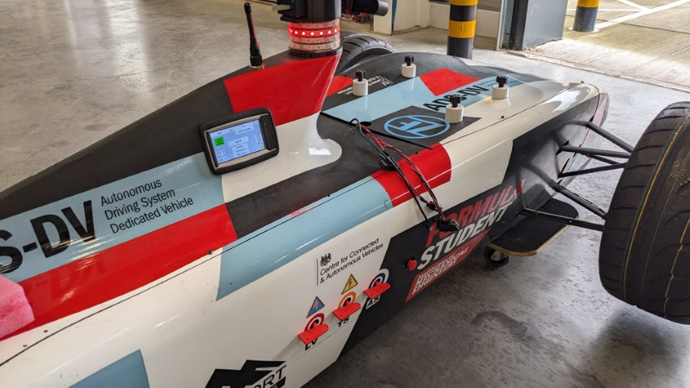

8. Wait for the Emergency Brake System to transition from "EBS Init" to "EBS Armed". The sound of the pump running may be heard.

   > **Note:** If the Emergency Brake System has been completely discharged for storage, it may take more than one pump cycle to arm. This is normal. The status of the Emergency Brake System can be viewed on the Touch Screen. It will progress from "EBS Init" through "EBS Charging" to "EBS Armed".

9. Wait for the Autonomous System to progress from "AS Init" to "AS Off".

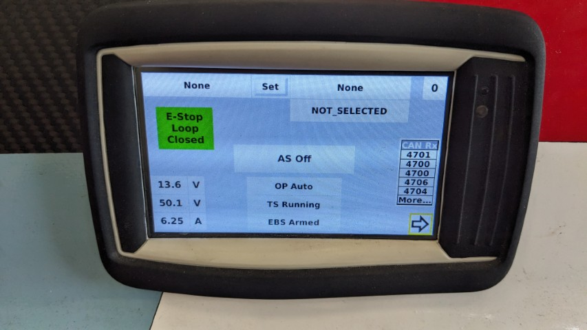

10. Insert the GEMS DA3 Datalogger Memory Card, or confirm insertion, and verify that the two LEDs are both showing "Green".

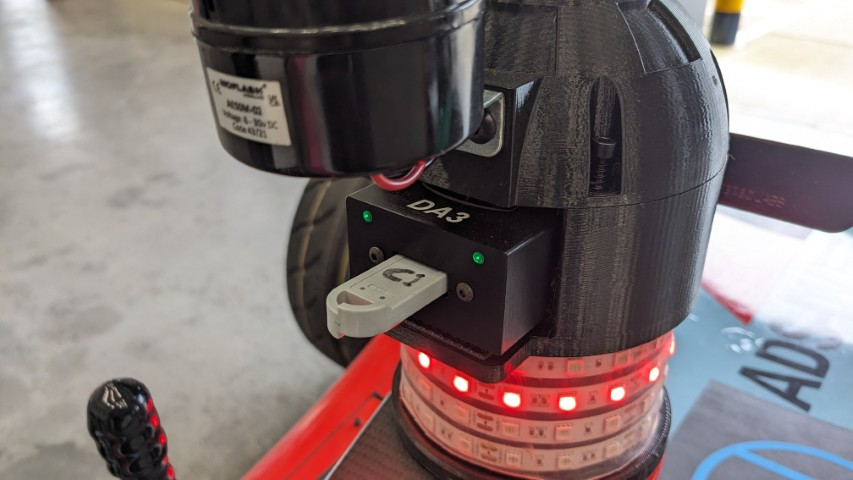

11. Select a Mission using the Touch Screen drop-down and press "Set".
12. Wait for the Autonomous System to progress from "AS Off" to "AS Ready", indicated on the Touch Screen and also by the TSAL Indicator LEDs showing "Red" and "Yellow".

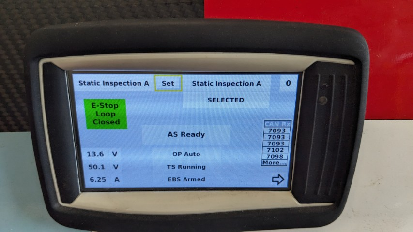  
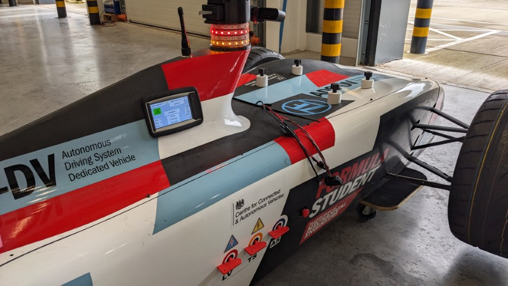

13. Wait for the TSAL Indicator LEDs to flash "Blue" as well as show "Red" and "Yellow", indicating the 5 second timer has elapsed. This 5 second timer is to allow the ASR to move away from the vehicle.

    > **Note:** The Autonomous State Machine CAN signal requirements are documented in [FS-AI ADS-DV Software Interface Specification](./FS-AI%20ADS-DV%20Software%20Interface%20Specification.md). The ADS-DV will not progress from "AS Off" to "AS Ready", or from "AS Ready" to "AS Driving", if these requirements are not strictly followed.

14. Activate the RES "Go" switch by toggling it from "0" to "1". This will transition the Autonomous System from "AS Ready" to "AS Driving".

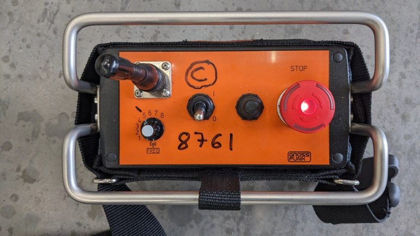  
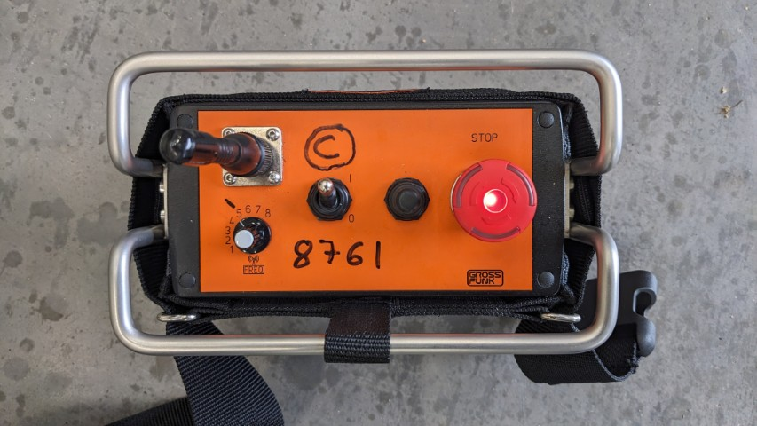

15. The Compute Platform should conduct the Mission by correctly controlling the ADS-DV using the CAN signals.

    > **Note:** The ADS-DV MUST be observed at all times by the ASR. The RES must remain strapped securely around the ASR's waist and on their person at all times. It must not be held in one hand, put down, or moved out of immediate reach. The Remote Emergency Stop MUST be used if the ADS-DV shows any anomalous behaviour.

    > **Note:** Full details on ADS-DV Operational Safety, for both Static and Dynamic operation, are documented separately.

16. Regardless of the success or failure of the Mission, resulting in either "AS Finished" or "Emergency Brake", the ADS-DV must be reset after every Mission by turning "Off" the LV Master Switch, Autonomous System Master Switch, and Tractive System Master Switch.
17. Remove the GEMS DA3 Datalogger Memory Card if the data is required for analysis.
18. Optionally, power down the Compute Platform by turning "Off" the AI Power Switch.

    > **Note:** If the AI Power Switch is left "On" it is important to minimise the time spent with the LV Master Switch "Off", to avoid the Compute Platform over-discharging the LV Battery and causing degradation of the battery performance.

    > **Note:** Ensure the AI Power Switch is switched "Off" even if the Compute Platform is removed.

Prepare the ADS-DV for storage (see [Preparation for Storage](#7-preparation-for-storage)) or return to Step 1 to conduct another mission.

## 7. Preparation for Storage

The ADS-DV should be prepared for storage any time it is left unattended.

### 7.1. Equipment Required

- MPP Dongle
- Remote Emergency Stop (RES)
- Red Switch Key (x1)

### 7.2. Procedure

1. Remove the Autonomous System Master Switch and Tractive System Master Switch keys, if present, and store securely.
2. Remove the GEMS DA3 Datalogger Memory Card, if present, and store securely.
3. Connect the MPP Dongle to the MPP.
4. Verify the AI Power Switch is switched "Off".

   > **Note:** Ensure the AI Power Switch is switched "Off" even if no Compute Platform is installed.

5. Ensure the RES has a charged battery installed.
6. Enable the RES by twisting the Emergency Stop button clockwise until it pops up.
7. Verify the RES is active by observing the Red LED is lit.

   > **Note:** The RES Red LED will flash if the battery is low on charge. It may also emit an audible tone. If this occurs, fit a charged battery and recharge the flat battery using the provided RES Battery Charger.

8. Verify the Side Emergency Stop Switches are "Out". If not, twist them clockwise until they pop out.
9. Turn "On" the LV Master Switch.
10. Verify the TSAL indicator LEDs show "Green".
11. Verify the Touch Screen Interface starts up.
12. Verify the E-Stop Loop indicator on the Touch Screen shows "Green".

    > **Note:** To complete the E-Stop Loop all the following need to be correct:
    >
    > - RES active
    > - Side Emergency Stop Switches "Out"
    > - MPP Dongle present
    > - Inertia Switch "Closed" (see [Section 9](#9-checking-and-resetting-the-inertia-switch))

13. Verify the LV Battery voltage is above 13.5V, indicating the DCDC converter is working. Typically, this will read between 13.5V and 14.5V.

    > **Note:** If the LV Battery voltage remains below 13.0V, turn off the LV Master Switch and contact FS-AI Technical Support.

14. Verify the Traction Battery voltage is above 50.0V. If it is lower than this, charge the Traction Battery to at least 50.0V according to the procedure below.
15. On the Touch Screen, switch to the "Service" page using the Right Arrow in the lower right of the screen.

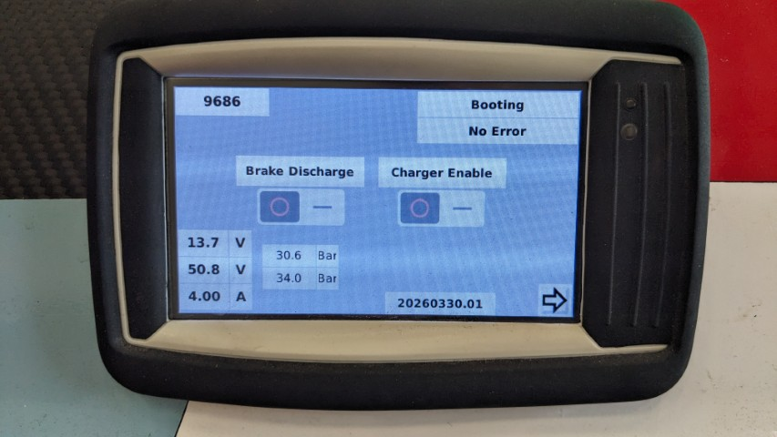

16. Press the "Brake Discharge" switch. Ensure the switch shows "On".

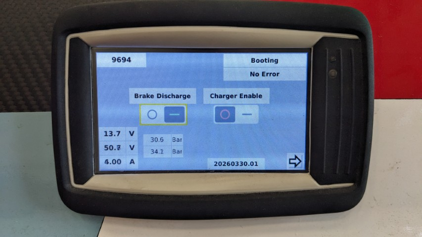

17. Verify the Emergency Brake System is discharging by observing the two Brake Pressures on the Touch Screen. These will deplete as the Emergency Brake System is pulsed on and off. This may be audible at first but will usually go quiet before the brakes are fully discharged.

    > **Note:** When the Brake Pressures are depleted to zero and the wheels of the ADS-DV can be turned manually, the discharge is complete.

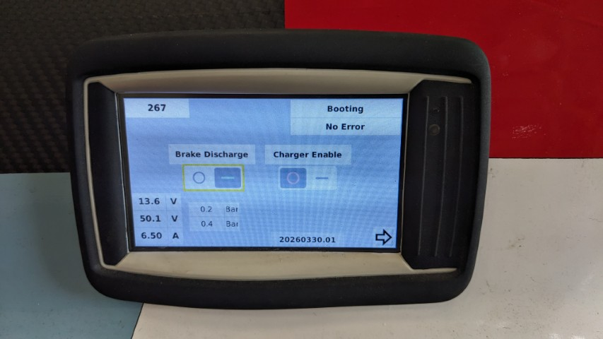

18. Turn "Off" the LV Master Switch, remove the Switch Key, and store securely.
19. Turn "Off" the RES by pressing in the Emergency Stop button and observing the Red LED is unlit.
20. Store the RES securely and recharge the battery if required.
21. Remove the MPP Dongle and store securely.

    > **Note:** During storage the brake lines remain locked-off by a normally closed valve. Thus, a variation in temperature or ambient pressure may result in the wheels re-locking. If this occurs the residual brake line pressure is still very low compared to the deployed EBS pressure.

## 8. Charging the Traction Battery

> **Note:** The Traction Battery MUST be recharged if the voltage displayed on the Touch Screen is below 47.5V with the ADS-DV idle, or is below 50.0V when preparing for storage.

### 8.1. Equipment Required

- MPP Dongle
- Remote Emergency Stop (RES)
- Red Switch Key (x1)
- Traction Battery Charger

### 8.2. Procedure

1. Ensure the Traction Battery Charger is unplugged from the mains and the Power Switch on the rear of the Traction Battery Charger is set to "0" (Off).

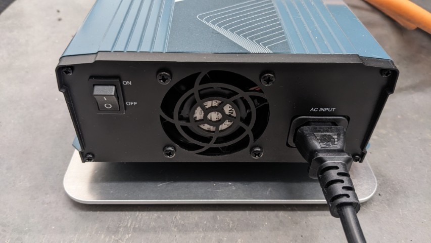

2. Connect the Traction Battery Charger Output Connector to the Charge Port at the rear of the ADS-DV.

   > **Note:** Ensure the Traction Battery Charger Output Connector is fully engaged and the Red latch is pushed forward.

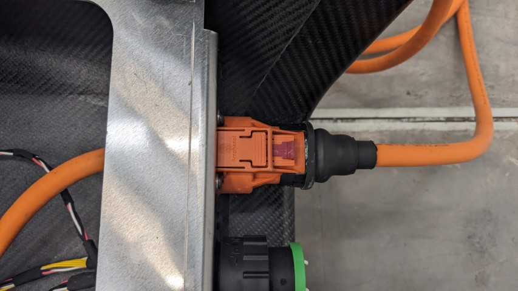

3. Connect the MPP Dongle to the MPP, or verify it is already connected.
4. Ensure the RES has a charged battery installed.
5. Enable the RES by twisting the Emergency Stop button clockwise until it pops up.
6. Verify the RES is active by observing the Red LED is lit.

   > **Note:** The RES Red LED will flash if the battery is low on charge. It may also emit an audible tone. If this occurs, fit a charged battery and recharge the flat battery using the provided RES Battery Charger.

7. Verify the Side Emergency Stop Switches are "Out". If not, twist them clockwise until they pop out.
8. Turn "On" the LV Master Switch.
9. Verify the TSAL indicator LEDs show "Green".
10. Verify the Touch Screen Interface starts up.
11. Verify the E-Stop Loop indicator on the Touch Screen shows "Green".

    > **Note:** To complete the E-Stop Loop all the following need to be correct:
    >
    > - RES active
    > - Side Emergency Stop Switches "Out"
    > - MPP Dongle present
    > - Inertia Switch "Closed" (see [Section 9](#9-checking-and-resetting-the-inertia-switch))

12. Verify the LV Battery voltage is above 13.5V, indicating the DCDC converter is working. Typically, this will read between 13.5V and 14.5V.

    > **Note:** If the LV Battery voltage remains below 13.0V, turn off the LV Master Switch and contact FS-AI Technical Support.

13. On the Touch Screen, switch to the "Service" page using the Right Arrow in the lower right of the screen.

14. Press the "Charge Enable" switch. Ensure the switch shows "On".

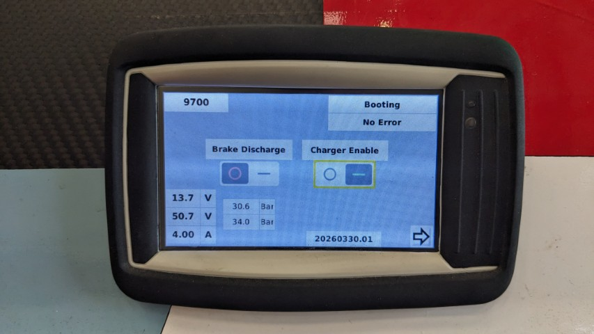

15. Plug the Traction Battery Charger into the mains.
16. Turn the Power Switch on the rear of the Traction Battery Charger to "1" (On).

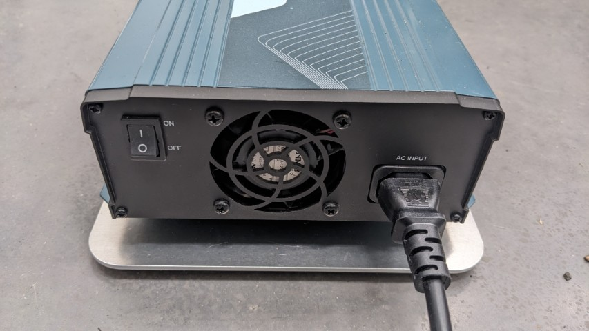

17. Verify that the LED on the Traction Battery Charger shows "Orange", or "Green", but not "Red". If not, or if charging does not start, cycle the Power Switch on the rear of the Traction Battery Charger from "1" to "0" and back to "1".

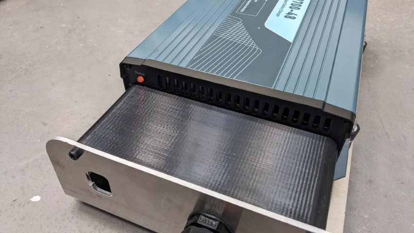

18. Verify on the Touch Screen that the Traction Battery voltage increases and the current goes negative, showing current is flowing to the Traction Battery.

    > **Note:** Depending on the state of charge the current will vary from -25.0A to approximately -2.0A, while the Traction Battery voltage will vary from approximately 52.0V to approximately 58.0V.

    > **Note:** The Traction Battery charge may be terminated at any time, but it is recommended to wait until the current is lower than 5.0A and/or the voltage is higher than 56.0V.

18. Turn the Power Switch on the rear of the Traction Battery Charger to "0" (Off).

19. Unplug the Traction Battery Charger from the mains.
20. Turn "Off" the LV Master Switch.
21. Turn "Off" the RES by pressing in the Emergency Stop button and observing the Red LED is unlit.
22. Disconnect the Traction Battery Charger Output Connector from the Charge Port at the rear of the ADS-DV.

    > **Note:** First pull the Red latch rearwards, then depress both the Orange latch tabs before pulling the Charger Output Connector off the Charge Port. Otherwise, connector damage may occur.

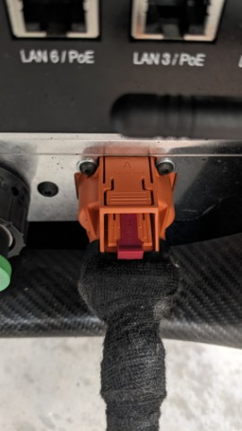
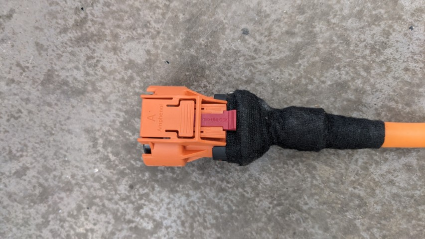

23. Store the Traction Battery Charger safely and securely to avoid damage.

    > **Note:** At this point, follow either the [Preparation for Operation](#5-preparation-for-operation) procedure or the [Preparation for Storage](#7-preparation-for-storage) procedure, depending upon requirements.

## 9. Checking and Resetting the Inertia Switch

### 9.1. Procedure

1. Remove the Front Bodywork Panel.

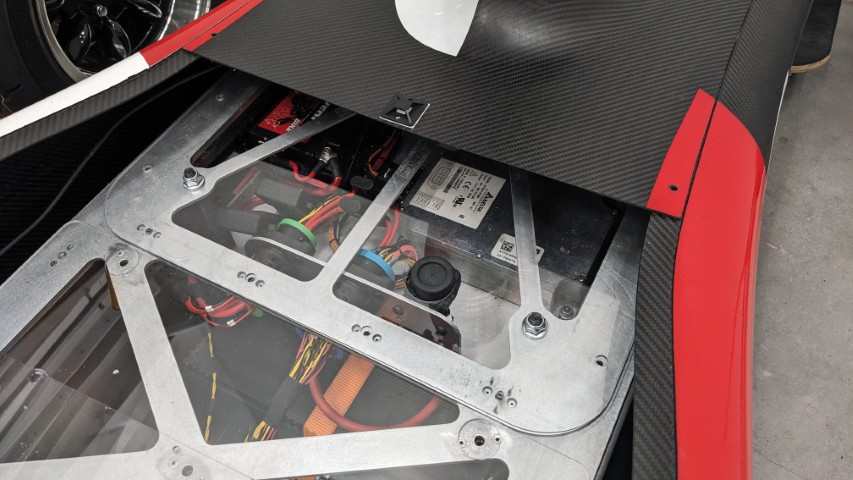

2. Locate the Inertia Switch.

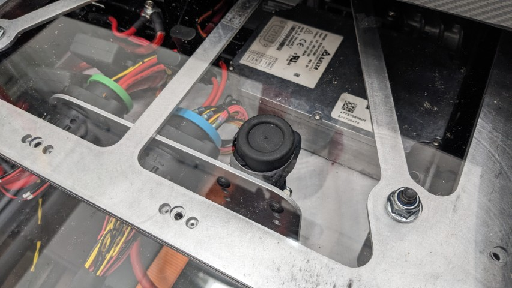

3. Press the Inertia Switch down - if there is a 'click' the switch had triggered and is now reset.
4. Verify the E-Stop Loop indicator on the Touch Screen now shows "Green".

## 10. Charging the RES Battery

### 10.1. Equipment Required

- RES Battery
- RES Battery Charger
- RES Battery Charger Power Adapter

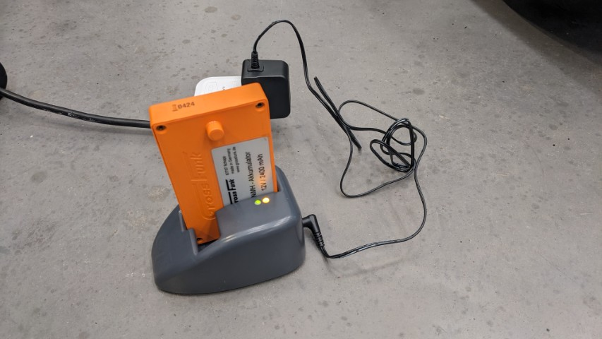

### 10.2. Procedure

1. Plug the Power Adapter into the RES Battery Charger, one LED should light up "Green".
2. Insert the RES Battery into the RES Battery Charger, the 2nd LED should light up "Yellow".
3. When the RES Battery is charged, the 2nd LED will turn "Green".

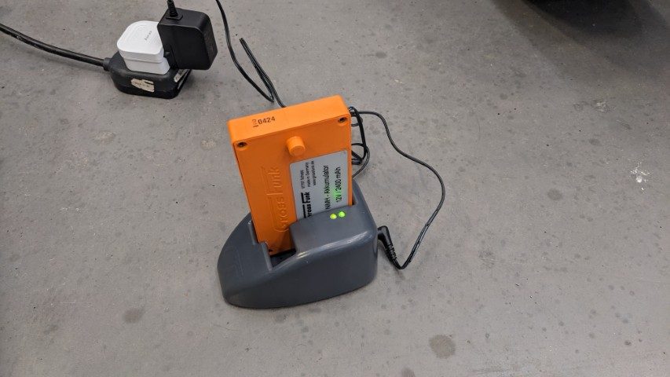

## 11. Support Contacts

- IMechE Formula Student Office: [fs@imeche.org](mailto:fs@imeche.org)
- IMechE Formula Student AI Technical Support: [ian.murphy@member.imeche.org](mailto:ian.murphy@member.imeche.org)
